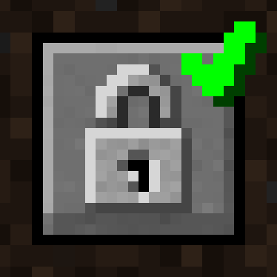

# Auth Me

Authenticate yourself in Minecraft and re-validate your session

[][ci:release]
[][releases]
[][curseforge]
[][curseforge:files]

Auth Me is a **Minecraft mod** that brings account authentication into the game
in the efforts of overcoming the infamous session validation error when
connecting to a server.

It is a **client-side** only mod and is available for modern versions
of [Minecraft][minecraft] Java Edition.

#### Alternatives

- [ReAuth][reauth_mod] by TechnicianLP
- [OAuth][oauth_mod] by Sintinium

## Sponsors

We would like to extend our thanks to the following sponsors for supporting
Auth Me development.

[][bisecthosting]

## Contributing

Thank you for considering contributing to Auth Me! Please see the
[Contribution Guidelines][contributing].

## Security Vulnerabilities

Please review the [Security Policy][security] on how to report security
vulnerabilities.

## Licence

Auth Me is open-sourced software licenced under the [MIT licence][licence].

[bisecthosting]: https://bisecthosting.com/axieum
[ci:release]: https://github.com/axieum/authme/actions/workflows/release.yml
[contributing]: .github/CONTRIBUTING.md
[curseforge]: https://curseforge.com/minecraft/mc-mods/auth-me
[curseforge:files]: https://curseforge.com/minecraft/mc-mods/auth-me/files
[fabric]: https://fabricmc.net/
[licence]: https://opensource.org/licenses/MIT
[minecraft]: https://minecraft.net/
[oauth_mod]: https://github.com/Sintinium/oauth
[reauth_mod]: https://github.com/TechnicianLP/ReAuth
[releases]: https://github.com/axieum/authme/releases
[security]: .github/SECURITY.md
