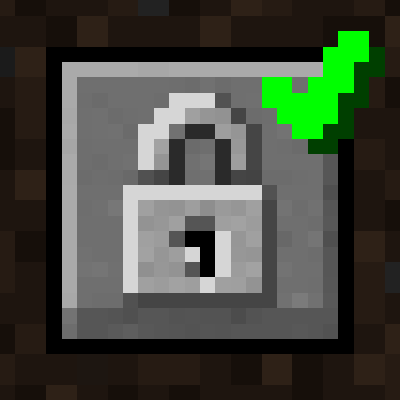

<p align="center">
    <a href="https://github.com/Axieum/AuthMe"></a>
</p>

<p align="center">
    <a href="https://curseforge.com/minecraft/mc-mods/auth-me-for-fabric"></a>
    <a href="https://curseforge.com/minecraft/mc-mods/auth-me-for-fabric/files"></a>
    <a href="build.gradle"></a>
    <a href="https://github.com/Axieum/AuthMe"></a>
    <a href="https://opensource.org/licenses/MIT"></a>
</p>

# AuthMe for Fabric
> Authenticate yourself in Minecraft and re-validate your session

### What does it do?

This Minecraft mod helps overcome the infamous session validation error when
connecting to a server:

```
Failed to log in: Invalid session (Try restarting your game and the launcher)
```

...by adding a session validation button to the multiplayer screen. Clicking
this new button will allow you to re-login (hence can be used to changed
Minecraft accounts) to revalidate your session - all without restarting the
game.

_As a side effect, you can use this to connect to "offline" servers with a
custom username (will have to be set each launch)._

### Acknowledgements

- [ReAuth](https://github.com/TechnicianLP/ReAuth) by TechnicianLP
  - The original session validator mod for Minecraft `<= 1.12.2`
